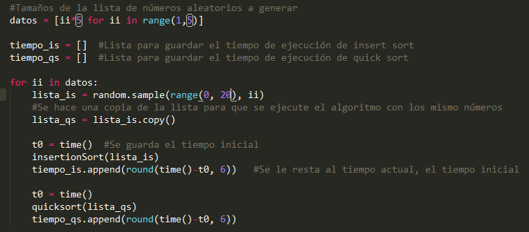
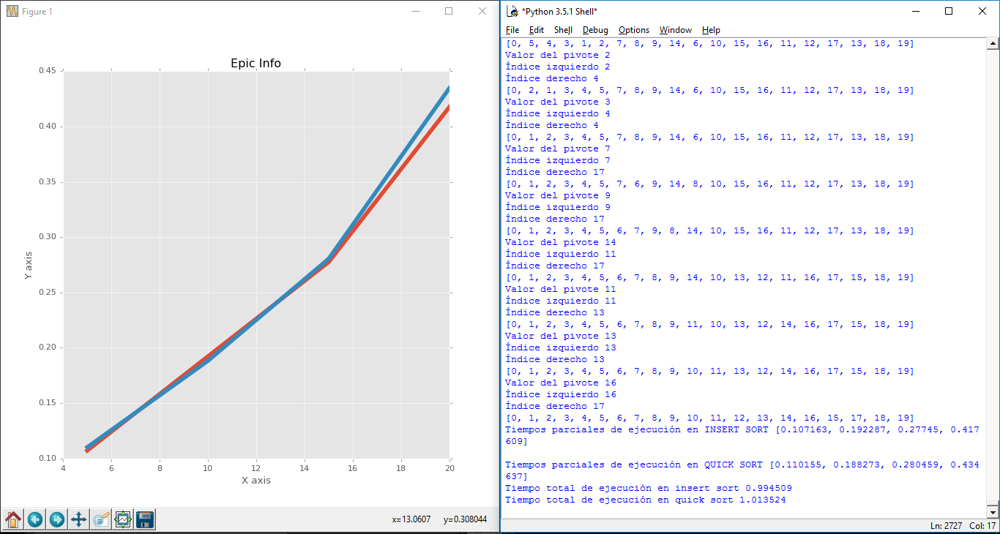
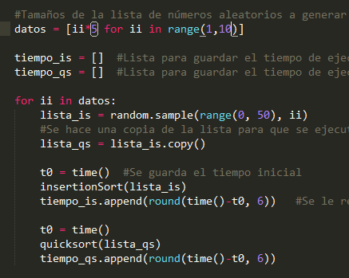
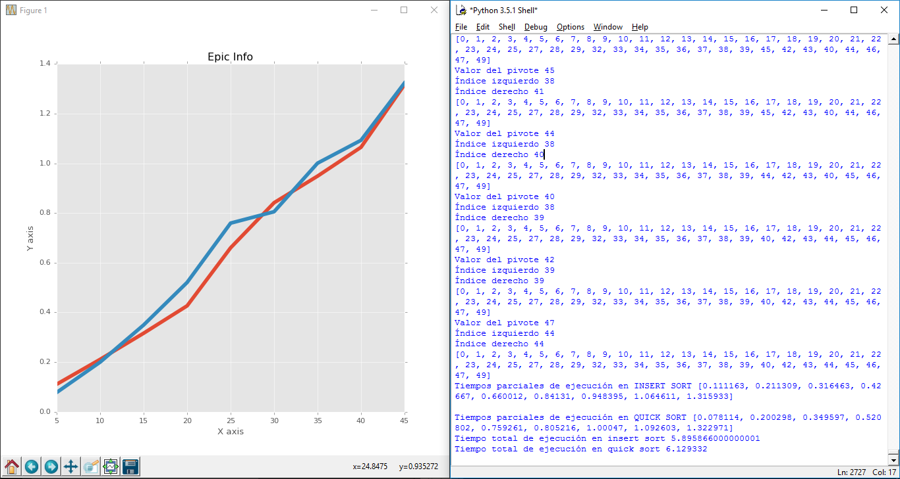

# Basic Matplotlib for python

## FIRST of all.... The easiest way to install MatLibPlot is using PIP.

Make sure you have pip installed by typibg "pip" in the terminal or console. Then just: 

### pip install matplotlib 

# First graphic 
check the values on : "DATOS" on top  and " lista_is "
please check random.sample() function to know how it works.

##output:

# Second graphic 

##output:

All this code is in # bothEXP.py lines of interest 91 and 97.

#Data.py

This is just a plain a EASY example of matplotlib.

#quick.py 

is inside both.py and bothEXP.py 

#both.py

Is the combination of quick.py and sort.py without a FOR loop that get diferent times... kinda bussy dont open it.

